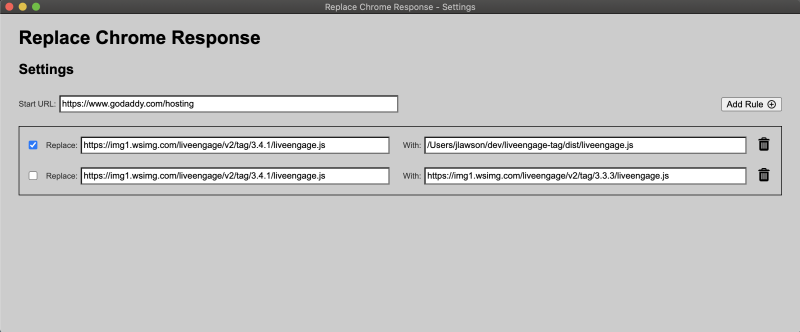

# Replace Chrome Response

This tool allows you to launch the Chrome browser with a URL and will replace responses for javascript resources requested by the loaded page with the contents of other javascript files.

The starting URL and the rules for the javascript requests that should be replaced are specified in a configuration file (config.js). This JSON file may be hand-edited prior to launching the application, or modified using the provided GUI.


## Launching the application

```
npm start
```


## Launching the application with the configuration GUI

```
npm run start:gui
```


### Configuration schema

```
{
  "startUrl": "https://www.godaddy.com/hosting",
  "rules": [
    {
      "match": "https://img1.wsimg.com/liveengage/v2/tag/3.4.1/liveengage.js",
      "replace": "/Users/jlawson/dev/liveengage-tag/dist/liveengage.js",
      "enabled": true
    },
    {
      "match": "https://img1.wsimg.com/liveengage/v2/tag/3.4.1/liveengage.js",
      "replace": "https://img1.wsimg.com/liveengage/v2/tag/3.3.3/liveengage.js",
      "enabled": false
    }
  ]
}
```


### Settings GUI
