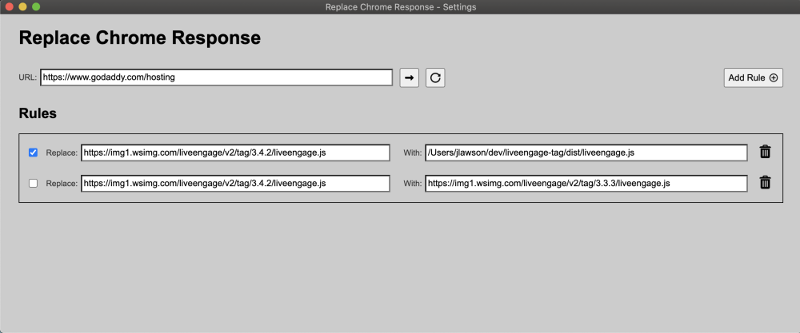

# Replace Chrome Response

This tool allows you to launch the Chrome browser with a URL and will replace responses for javascript resources requested by the loaded page with the contents of other javascript files. These javascript files can be fetched from a server or loaded from disk.

The starting URL and the rules for the javascript requests that should be replaced are specified in a configuration file (config.js). This JSON file may be hand-edited prior to launching the application, or modified using the provided GUI. Rule changes made from the GUI will take effect immediately (without restarting the app).

The GUI also provides a button for navigating if you wish to change the current URL, as well as a button to reload the page - which you will likely want to do after making changes to your rules.


## Launching the application

```
npm start
```


## Launching the application with the configuration GUI

```
npm run start:gui
```


### Configuration schema

```
{
  "startUrl": "https://www.godaddy.com/hosting",
  "rules": [
    {
      "match": "https://img1.wsimg.com/liveengage/v2/tag/3.4.1/liveengage.js",
      "replace": "/Users/jlawson/dev/liveengage-tag/dist/liveengage.js",
      "enabled": true
    },
    {
      "match": "https://img1.wsimg.com/liveengage/v2/tag/3.4.1/liveengage.js",
      "replace": "https://img1.wsimg.com/liveengage/v2/tag/3.3.3/liveengage.js",
      "enabled": false
    }
  ]
}
```


### Settings GUI
